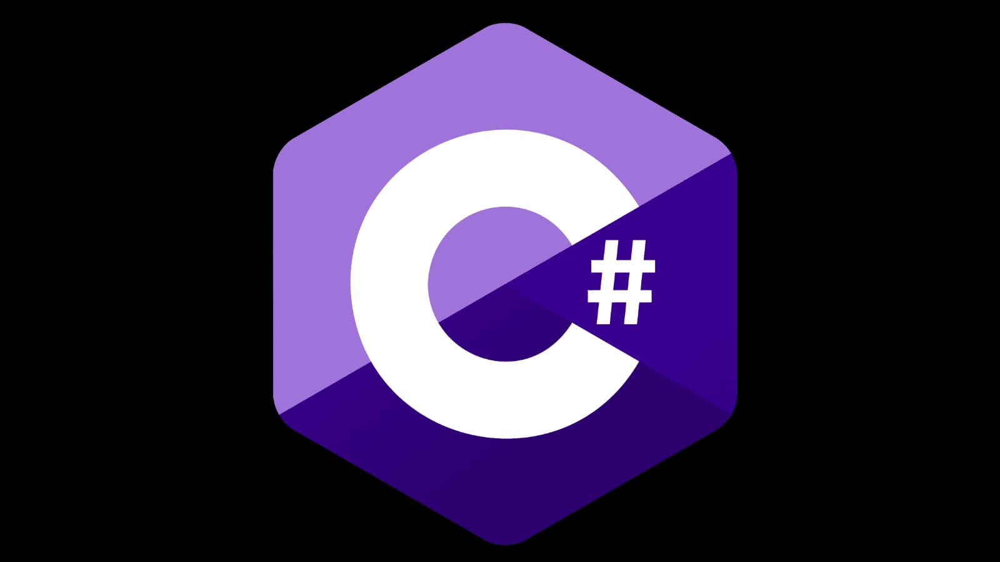

  
   

# 🚀 Belajar C# (C-Sharp)

Selamat datang di repository belajar saya! 👋

Repository ini berisi dokumentasi perjalanan saya mempelajari bahasa pemrograman *C#* dan *.NET*, mulai dari tugas-tugas dasar kuliah hingga eksperimen kode pribadi.

> "Coding is not just about syntax, it's about logic."

## 📂 Struktur Materi
Saya mengurutkan materi berdasarkan topik pembelajaran:

| No | Topik | Deskripsi Singkat |
| :--- | :--- | :--- |
| 01 | **Biodata** | Pengenalan dasar Console, String, dan Output. |
| 02 | **Decision** | Penggunaan If-Else dan Switch Case. |
| 03 | **Looping** | Penggunaan For, While, Do While, Foreach Loop. |
| 04 | **Exception Handling** | Penanganan error dengan Try, Catch, dan Finally. |
| 05 | **Array** | Penyimpanan kumpulan data dengan indeks tetap. |
| 06 | **Queues** | Struktur data antrean (FIFO - First In First Out). |
| 07 | **Stack** | Struktur data tumpukan (LIFO - Last In First Out). |
| 08 | **LinkedList** | Penyimpanan data berantai (Node) yang dinamis. |
| 09 | **Intro OOP** | Pengenalan Class, Object, dan Attribute dasar. |
| 10 | **OOP Separate File** | Penerapan Class pada file terpisah (Namespace). |
| 11 | **OOP Encapsulation** | Proteksi data menggunakan Private field dan Public Property (Get/Set). |
| 12 | **OOP Inheritance** | Konsep pewarisan sifat dari Class Induk (Parent) ke Class Anak (Child). |
| 13 | **Inheritance Lanjut** | Pewarisan bertingkat (Multilevel) dan pemisahan file Class. |
| 14 | **Structure & Namespace** | Manajemen file OOP menggunakan Folder dan Namespace yang rapi. |
| 15 | **OOP Polymorphism** | Mengubah perilaku method Induk menggunakan `virtual` dan `override`. |
| 16 | **OOP Abstraction** | Penggunaan Abstract Class sebagai kerangka dasar (Wajib Override). |
| 17 | **OOP Interface** | Kontrak kemampuan (Skill) yang bisa diterapkan pada banyak Class berbeda. |
| 18 | **OOP Gabungan** | Proyek latihan menggabungkan Encapsulation, Inheritance, Polymorphism, & Interface. |

## 🛠 Tools & Lingkungan
Meskipun materi ini dipelajari dengan gaya klasik (untuk kebutuhan Lab Kampus), saya menjalankannya di lingkungan modern:
* *Bahasa:* C#
* *Framework:* .NET 10 (LTS)
* *Editor:* Visual Studio Code
* *OS:* Windows

## 📝 Catatan Penting
Kodingan di sini sebagian besar menggunakan *Style Legacy* (Namespace/Class/Main) untuk menyesuaikan dengan kurikulum kampus yang menggunakan Visual Studio 2012, agar kompatibel saat ujian Lab.

---
*Author:* [YudanThara](https://github.com/YudanThara)  
Mahasiswa Informatika | UMP 
